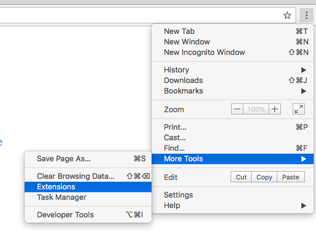
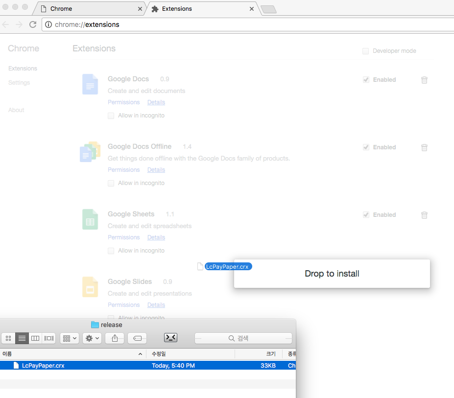

# LcPayPaper

PayPaper Decrypt Chrome Plugin.

Don't Need ActiveX!

## Install

### - Chrome Web Store

* [Download From 'Chrome Web Store'](https://chrome.google.com/webstore/detail/nplnninmekjdbcdggfkfjhhnbkendelb)

### - Manual Install

1. Download [LcPayPaper](https://github.com/GomPam/LcPayPaper/releases)

1. Open Chrome Extensions Page  
> 

1. LcPayPaper.crx Drag & Drop
> 

1. Checked "Allow access to file URLs" Option

1. Done.

## Using Library

* [jquery](https://github.com/jquery/jquery)
* [crypto-js](https://github.com/tomyun/crypto-js) - Using RC2-CBC Decrypt

## Special Thanks

* [enghqii](https://github.com/enghqii) - Make LcPayPaper Node.Js, Referenced Logic
