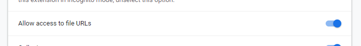
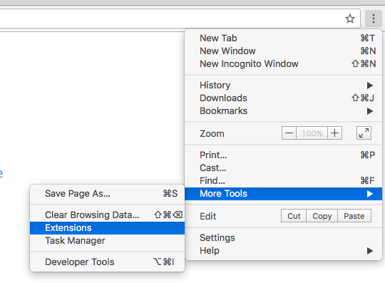
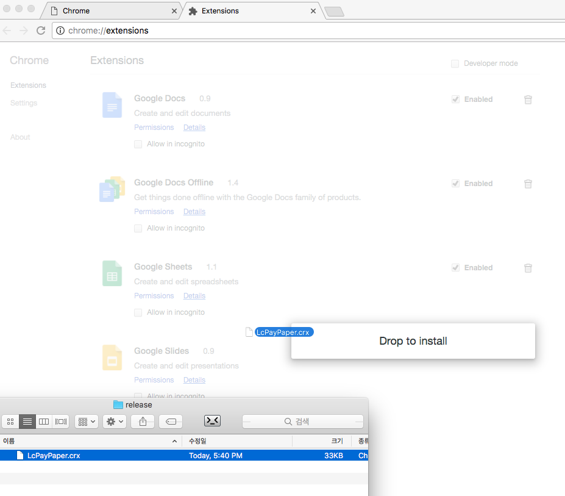

# LcPayPaper

Duzon Erp 기반의 암호화된 메일을 ActiveX 없이 볼 수 있는 뷰어

* Html 파일을 다운로드해서 열어주고, 암호를 입력해주면 끝!

* 정상적으로 작동되지 않는다면? "파일 URL에 대한 액세스 허용" 옵션 체크을 확인해주세요!

## Install

#### 1. Chrome Web Store

1. [Download](https://chrome.google.com/webstore/detail/nplnninmekjdbcdggfkfjhhnbkendelb) From 'Chrome Web Store'

1. Open Chrome Extensions Page  
> 

1. Checked "Allow access to file URLs" Option
> 

1. Done.

#### 2. Manual Install

1. Download [LcPayPaper](https://github.com/GomPam/LcPayPaper/releases)

1. Open Chrome Extensions Page  
> 

1. LcPayPaper.crx Drag & Drop
> 

1. Checked "Allow access to file URLs" Option
> 

1. Done.
## Using Library

* [jquery](https://github.com/jquery/jquery)
* [crypto-js](https://github.com/tomyun/crypto-js) - Using RC2-CBC Decrypt

## Special Thanks

* [enghqii](https://github.com/enghqii) - Make LcPayPaper Node.Js, Referenced Logic
