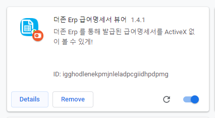

# Duzon Erp Payslip

Duzon Erp 기반의 암호화된 급여명세서을 ActiveX 없이 볼 수 있는 뷰어

* Html 파일을 다운로드해서 열어주고, 암호를 입력해주면 끝!

* 정상적으로 작동되지 않는다면? "파일 URL에 대한 액세스 허용" 옵션 상태을 확인해주세요!
  

## Install - Use To Chrome Web Store

1. [Download](https://chrome.google.com/webstore/detail/nplnninmekjdbcdggfkfjhhnbkendelb) From 'Chrome Web Store'

1. Open Chrome Extensions Page
  

1. Find 'Duzon Erp Payslip' And Clicked 'Details'
  

1. Checked "Allow access to file URLs" Option
  

1. Done.

## Manual Install Is Deprecated!
* Why? - [[Google Chrome Policy]](https://blog.chromium.org/2018/06/improving-extension-transparency-for.html)

## Using Library

* [jquery](https://github.com/jquery/jquery)
* [crypto-js](https://github.com/tomyun/crypto-js) - Using RC2-CBC Decrypt

## Special Thanks

* [enghqii](https://github.com/enghqii) - Make LcPayPaper Node.Js, Referenced Logic
